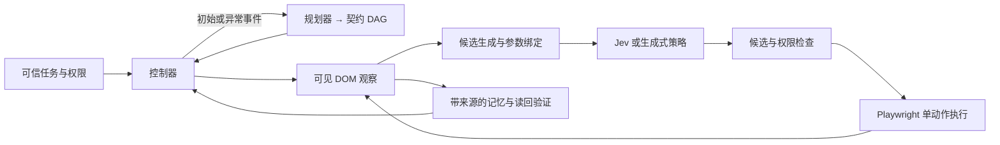

# Jev LongSeq

按提供的三份设计文档实现的浏览器长任务系统。包含可运行的 Playwright 执行器、候选决策、Jev HTTP 接口、事件触发规划、子任务契约、来源记忆、写入读回和评测工具。

新增 **LLM 大脑 + Jev 小脑动态反馈模式**：提供自然语言目标（起始 URL 可选），从可见 DOM 生成候选，不需要预先编写控件规则、实体列表、抽取字段或成功谓词。LLM 按阶段/异常提供简短指导，Jev 在两次大脑调用间连续执行；旧的契约 DAG 模式保留作对照。设计与效率指标见 [动态 agent](docs/DYNAMIC-AGENT.zh-CN.md)。

已增加 [可观测模块与 autoresearch](docs/AUTORESEARCH.zh-CN.md)：模型请求/重试、浏览器和大小脑阶段可关联追踪，自动生成问题报告。`autoresearch` 默认对 Books to Scrape 的两个公共网页任务（借鉴 WebArena #50 / #332 类型，不计作官方成绩）各跑基线与一个候选（最多四个 episode），Codex GPT‑6 high 按观测提出阶段窗口、证据上下文或提示词的单项调整；研究分析调用也计入总预算。严格完成且通过效率/退化检查才保留配置。网络失败与提前退出不会被记作效率胜出。

```bash
uv run jev-browser autoresearch --suite public-web --task-ids 50 332 --max-trials 2 --metric tokens \
  --env-file /path/to/your.env --brain api --output runs/research-01
uv run jev-browser observe runs/research-01
# Autoresearch 工作台：http://127.0.0.1:8769/research
uv run jev-trace --runs runs --port 8769 --env-file /path/to/your.env
```

```bash
uv run jev-browser browse https://example.com --goal '你的任务目标' \
  --env-file /path/to/your.env --brain api \
  --brain-interval 12 --max-feedback-calls 40 --output runs/dynamic

# 同一自建任务：12 步阶段窗口；设为 1 可测量每步调用大脑的对照
uv run jev-browser demo --mode dynamic --policy jev --records 12 \
  --env-file /path/to/your.env --brain api \
  --brain-interval 12 --output runs/dynamic-demo
```

`browse` 默认使用 Jev；LongSeq 的 LLM 大脑及按需输入助手默认使用项目配置的 DeepSeek API，读取 `PLANNER_*`，缺省时兼容 `TEXT_MODEL_*`。小脑使用 Jev TypeSafe API。autoresearch 的分析与改进独立使用已登录的 Codex `gpt-6-astra` / `high`，不会替换 LongSeq 的 DS 模型。`--allow-origin` 可追加允许访问的源。`--max-feedback-calls` 计入大脑、完成复核、输入助手和格式纠正调用，失败 HTTP 重试另记在账本中。动态模式的完成为语义模型复核，用户任务的 `strict_success` 仍为 `null`；沙盒和公共任务由运行后的独立判分器判分。`report.json` 的 `efficiency` 分别记录大脑、Jev、输入助手的请求次数、耗时、tokens、未知 usage 与费用。

本地沙盒可以直接运行，无需模型密钥。真实 Jev / 生成式模型通过环境变量接入。已接入 **BrowserGym 0.13.3**，提供最多两个任务的 pilot 入口。自建目录任务、官方 WebArena 与 WebChoreArena 分开记录，不把沙盒成绩当作公共 benchmark 成绩。

## 启动

需要 Python 3.11+、[uv](https://docs.astral.sh/uv/)。

```bash
uv sync --locked --extra dev --extra chrome
export PLAYWRIGHT_BROWSERS_PATH="$PWD/.browsers"
uv run playwright install chromium

# 32 条记录，分页读取详情、按条件保存、逐条读回，加入弹窗和页面提示注入
uv run jev-browser demo --records 32 --popup --injection --output runs/demo-long

# 相同观察、候选和记忆，比较三种调度方式的工程行为
uv run jev-browser matrix --sizes 4 12 32 --repeats 1 --output runs/matrix

uv run pytest -q
uv run ruff check src tests
```

输出目录必须为空，防止覆盖或混合不同实验的轨迹。退出码：`0` 完成，`1` 运行失败/超时/需要处理，`2` 参数错误。

## Trace Studio 与网页实时预览

复用 Jev Ultrafast 的本地 HTTP 服务模式、浏览器画面/侧栏/轨迹布局和样式。无前端构建步骤，无新增运行依赖；来源与 MIT 许可保留在 `src/jev_browser/static/`。

```bash
# 读取已有 runs/，包括历史失败和成功的真实模型任务
uv run jev-trace --runs runs --port 8767 --env-file /path/to/your.env
# 不更新安装也可直接启动
.venv/bin/python -m jev_browser.inspector --runs runs --port 8767 --env-file /path/to/your.env
```

打开 **http://127.0.0.1:8767**。切换运行记录后，可筛选/搜索事件、拖动时间线、逐事件前进后退、以 1× 原始时间回放，并查看候选及置信度、契约、证据来源和原始事件。已有运行的网页画面读取 `trace.zip` 内真实 screencast 截图，无需重新调用模型。没有录制帧时仅显示明确标注的最终截图。

页面默认“网页任务 · 当前 Chrome”，只填 prompt 即可点击“运行 prompt”。起始网址可留空：优先使用手动网址，其次识别 prompt 中的 URL/域名（例如 `打开X.com依次搜索…`），否则由所选规划模型判断；页面及 manifest 会显示选址结果和理由。不明确的“当前页面”任务会提示补充信息。也可切换为本地目录样例（1–100 条）。也可先点“填入示例 prompt”。页面默认 DeepSeek API（当前配置为 `deepseek-flash`），真实执行使用 Jev + 所选规划模型（已登录的 Codex CLI 或已配置的 API）；API 支持 `PLANNER_*` 或现有 `TEXT_MODEL_*` 配置，Codex 认证失败时不会暗中切换到 API。密钥从服务端 `--env-file` 读取，不进入页面。任务最多 5 分钟 / 150 动作，同一查看器一次运行一个任务，自动跟随实时画面并展示最终回答。自定义 prompt 不使用固定目录任务的独立判分。规则演示仍无需模型配置。

网页任务和 `browse` 默认通过 Browser Harness 发现并连接本机 Chrome，复用当前配置的登录状态。先安装 `uv sync --extra chrome`，并在 Chrome 的 `chrome://inspect/#remote-debugging` 中允许远程调试。每次运行新建任务标签页，结束后保留；其他标签页不会被操作或录制。需要独立浏览器时可显式使用 `--backend playwright`。Chrome 未开放连接时会明确报错，不会自动退回空白登录会话。

Chrome 预览及历史回放来自任务标签页的真实截图，存储在 `preview/` 与 `frames.jsonl`；不会对共享浏览器配置开启全局 trace。已有 Playwright / BrowserGym 记录继续读取 `trace.zip`。当前登录会话可解决独立会话造成的访问差异，但网站仍可能要求登录或验证。

CLI 可省略 browse 的位置参数，选址调用计入模型账本和总时限：

```bash
uv run jev-browser browse --goal '在维基百科查找太阳能的定义' \
  --brain api --env-file /path/to/your.env --live-preview
```

CLI 同样支持自定义目录任务：

```bash
uv run jev-browser demo --mode dynamic --policy jev --records 12 \
  --goal '查看 item-001 的评分和价格，不要保存或删除' \
  --env-file /path/to/your.env --live-preview --output runs/custom-prompt
```

新运行加 `--live-preview`，查看器会自动跟随正在写入的轨迹及网页截图：

```bash
# 无模型调用的本地演示；网页中的“运行本地演示”按钮也可启动
uv run jev-browser demo --records 12 --live-preview --output runs/live-demo

# 已有 benchmark/run 命令同样可以追加 --live-preview
```

实时截图由浏览器后端连续采集（最多约 2 帧/秒），页面每秒刷新；不触发浏览器动作、不改变模型观察、不发送截图给模型。截图开销计入墙钟时间，所以性能对照应统一这一选项。运行结束后自动切换历史回放；截图中断超过 5 秒不再标为 LIVE。查看器只绑定 `127.0.0.1`，仅能读取指定 runs 目录中的运行资源；网页启动按钮固定使用规则策略，不读取或发送模型密钥。

详细实现与验证见 [Trace Studio 验证记录](docs/TRACE-UI.md)。

## 模型运行

### 只跑一两个长任务

```bash
uv sync --locked --extra dev --extra benchmark

# BrowserGym 后端、自建长任务，只跑 24 条记录这一项
# --env-file 显式加载现有配置，不执行 shell，不复制密钥
# 大脑使用现有 DeepSeek API；env 文件提供 DS、Jev / benchmark 环境配置
uv run jev-browser benchmark --suite catalog --sizes 24 \
  --env-file /path/to/your.env --brain api \
  --policy jev --planner llm --mode event \
  --max-actions 140 --max-planner-calls 4 --max-seconds 600 \
  --output runs/gym-pilot

# 官方 WebArena 只读聚合任务：全年已完成订单统计、三个月逐月支出
# 缺少站点配置时写出 preflight.json 并停止，不偷偷回退成沙盒
uv run jev-browser benchmark --suite webarena --task-ids 50 332 \
  --env-file /path/to/your.env --brain api \
  --output runs/webarena-pilot
```

`--sizes` / `--task-ids` 最多两个，不做整套矩阵。官方 WebArena 需要 `WA_SHOPPING`、`WA_SHOPPING_ADMIN`、`WA_REDDIT`、`WA_GITLAB`、`WA_WIKIPEDIA`、`WA_MAP`、`WA_HOMEPAGE`，这是 BrowserGym 包的配置契约；本次两个候选任务实际访问 shopping 站点。选择这两个任务是为了跨页读取与统计，不声称已有人工标注的长程参考长度。

BrowserGym 的同步 Playwright 固定在单个工作线程，动作经公开 `HighLevelActionSet` 编译且 `multiaction=False`，不接受模型返回的 Python。DOM 观察与现有协议相同。迟到渲染需要刷新时使用公开 `noop(0)`；这类额外环境步记录在 `gym_env_steps/gym_refresh_steps`，不隐藏执行开销。判分结果只交给 runner，不放进模型上下文。

WebChoreArena 专用配置与部署仍未接入；不能把 WebArena 的任务编号当作 WebChoreArena 编号。

Jev 使用官方 `POST /v1/systemone` 的 `questions.action.type=choice` 和 `criteria`，并解析 `answers.action`。接口依据 [TypeSafe API 文档](https://docs.typesafe.ai/api)，不将 Choice 接口伪装成生成式模型。

```bash
export TYPESAFE_API_KEY='your-key'
export TYPESAFE_MODEL='your-pinned-model-version'

# Flat Jev + 结构化记忆（设计中的 B 对照）
uv run jev-browser demo --policy jev --mode flat --records 12 --output runs/jev-flat

# LongSeq 默认使用 API 大脑；已有 TEXT_MODEL_* 配置可直接复用
# 配置能够返回 JSON 的 chat-completions-compatible 规划服务
export PLANNER_API_KEY='your-key'
export PLANNER_ENDPOINT='https://your-provider.example/v1/chat/completions'
export PLANNER_MODEL='your-pinned-planner-model'

# 事件规划器 + Jev（D）；once 对应一次性规划（C）
uv run jev-browser demo --policy jev --planner llm --mode event --brain api --output runs/jev-event

# 外部只读任务示例
uv run jev-browser run examples/readonly-task.json --policy jev --mode flat --output runs/readonly
```

`--policy llm` 使用 `POLICY_API_KEY`、`POLICY_ENDPOINT`、`POLICY_MODEL`；可配置为小模型或强模型，对应 E / F 的候选约束对照。`--policy rule`、`--planner rule` 仅用于目录沙盒，是明确标记的测试替身。生产任务 `run` 不允许规则替身。

`.env.example` 列出全部变量；CLI 读取进程环境，不自动加载 `.env`。API 密钥不写入轨迹。页面、绑定值、截图和 trace 可能含任务数据，运行产物默认被 Git 忽略。

## 控制与权限

以下契约、业务规则、参数绑定和字段抽取机制适用于原有的 **structured / flat / once / event** 模式。动态模式的控制边界和完成语义见 [动态 agent](docs/DYNAMIC-AGENT.zh-CN.md)，不会把模型推断的业务意图伪装成代码级规则校验。



- 每个元素引用绑定 `observation_id / document_version / tab / frame`；执行前重新检查页面指纹和节点连接状态。页面重绘后即使按钮同名、HTML 相同，也不复用已断开的节点。
- 同名控件携带行/表单上下文。导航与 `NO_MATCH/REPLAN` 优先保留；候选不足时升级，不发明选择器、地址或输入内容。
- 子任务使用 DAG、操作白名单、参数来源、成功条件、不变量和动作预算。正常完成只推进 DAG；候选缺失、停滞、条件失效和预算耗尽才触发重规划。
- DSL 仅包含 `all / any / not / fact / text / url / no_pending_writes`；精确数值比较用 `Decimal`，不执行模型生成的代码。
- 页面文本始终是数据。任务目标、域名、规则、批准清单在可信任务 JSON 中配置，模型不能修改。
- 控件操作需匹配任务中的 `rules`。写入额外要求 `approved_writes`、实体与读回条件；这是调用方的独立批准边界，不能由模型生成批准。对真实站点只配置已审查的规则。
- 写入开始后进入 pending 状态；新的可见事实确认后才完成。读回失败返回 `needs_attention`，不会自动重提。不能把本地 write key 当成网站提供的幂等键。
- iframe / CAPTCHA 当前停止并返回需要处理；不绕过访问限制。浏览器使用隔离上下文，默认拒绝未经授权的源，不读取已有用户浏览器会话。

## 任务与观察格式

任务定义见 `examples/readonly-task.json`；完整类型见 `src/jev_browser/protocol.py`。`allowed_origins` 使用完整 origin，例如 `https://example.com`，需要的资源来源也应显式配置。`start_url` 是用户授权的初始地址，后续打开地址必须来自实际观察。

首版抽取器支持页面上明确显示的 `Entity: item-001`、`Price: 59.99` 等字段；只抽取 `extraction.fields` 的白名单字段。歧义标签不抽取，不同 URL 对同一事实给出不同值时标记冲突并停止使用该值。普通页面的语义抽取需新增证据约束的适配器，不能假定此抽取器适用于任意网站。

可信任务可设置 `extraction.capture_on_observe=true`：当实体和全部配置字段完整、无歧义地出现时，控制器在下次策略决策前执行一次 `extract_visible`，只有成功回执才记录事实。抽取受任务/当前契约权限约束，计入动作、子任务和时间预算；同一视图的相同证据不重复自动抽取。部分字段、加载页仍走普通观察/导航流程。目录任务默认开启，其他任务默认关闭；相同任务下所有策略与调度模式共享这一机制，配置会保存在 `task.json`。

页面摘要按 URL、标签、frame 和文档版本区分，最多保留 8 个视图。策略输入的 `verified_progress` 提供实体状态、缺失字段和下一条未验证记录；只从可信任务中可独立拆分的实体事实条件计算，不拆分跨实体的 `any/not`，也不替代最终任务验证。近期动作记录包含对象、描述、回执及前后观察标识；一个观察间隔内存在多次动作时，用 `intervening_actions` 明示。

`Binding.source` 支持用户值、已观察事实，以及显式开启 `allow_generated_bindings` 后的规划器内容。`fill/select` 只能使用这些绑定值；下拉值还必须属于当前选项。

## 故障与预算

```bash
uv run jev-browser demo --reorder --popup --output runs/reorder
uv run jev-browser demo --delayed-save-ms 350 --output runs/delayed
# 预期返回 needs_attention：保存发生但回执丢失；不应重复写入
uv run jev-browser demo --lost-ack --output runs/lost-ack

uv run jev-browser demo --max-actions 120 --max-seconds 60 --candidates 16 --output runs/budgeted
```

可配置动作数、总时限、循环数、规划次数、停滞阈值、加载/读回等待上限。CLI 暴露常用参数，其余由 `Budget` 配置。confidence 默认不作为升级门槛；需要独立开发集校准后才应设置 `Budget.confidence_threshold`。

重规划反馈包含当前契约、未满足条件、实体进度、近期动作和已用预算。规划器接口为 `plan(task, obs, memory, reason, *, feedback=None)`。JSON schema 校验失败最多纠正一次，纠正请求同样占用 `max_planner_calls`，HTTP 尝试、tokens 和费用照常记账（`kind=planner_repair`）。预算耗尽或纠正仍失败时停止，不执行非法计划，也不放宽权限检查。`invalid_plan` 轨迹保留错误位置、响应哈希及最多 12,000 字符的响应片段，并遮蔽已知规划 API 密钥和常见凭据字段；产物仍应视为可能包含任务数据。

## 产物与评测

每次运行生成 `manifest.json`、`task.json`、`trajectory.jsonl`、`memory.json`、`result.json`、`report.json`、`final.png` 和 Playwright `trace.zip`。启动失败时保留能够生成的失败报告。轨迹记录观察、候选、决策、计划、动作回执、验证和终态。

```bash
uv run playwright show-trace runs/demo-long/trace.zip
uv run jev-browser report runs/matrix
uv run jev-browser calibrate examples/calibration-labels.json
```

严格判分器在策略停止后单独读取沙盒终态；策略无法从接口获得判分真值。检查保存集合精确匹配、详情覆盖、误操作和重复写入。真实用户任务没有隐藏判分器，`strict_success=null`，不能把契约通过自动当成 benchmark 严格成功。

autoresearch 分析器的 Codex 返回的实际 input/output/cached-input tokens 单独记录，CLI 启动与连接开销计入请求耗时；订阅额度不折算为美元，费用保持 `null`。

成本账本保留失败请求及重试，记录模型返回版本、prompt hash、tokens 和延迟。配置 `*_INPUT_PER_MILLION`、`*_OUTPUT_PER_MILLION` 和 `--browser-hourly-cost` 后才能得出完整成本；未知成本保留为 `null`，不会报成免费。失败运行的成本也进入每次成功成本的分子。

评测模块还提供按任务聚类的配对 bootstrap、独立标注 Candidate Recall、Brier / ECE、风险—覆盖率和四次独立运行的 pass⁴。示例 calibration 标签仅用于说明输入格式，不是测量结果。

## 当前边界

详见 [实现说明](docs/IMPLEMENTATION.zh-CN.md)、[初版验证记录](docs/VERIFICATION.md) 和 [失败恢复修复验证（54 项通过）](docs/RECOVERY-VERIFICATION.zh-CN.md)。

- 已提供 Playwright、BrowserGym 执行器和官方 WebArena 只读 pilot；尚未实现 Browser Use 或 WebChoreArena 专用适配器。公共站点需另行配置，未部署时只有预检记录。
- 已实现基本标签切换接口；多站点、多标签长任务尚未系统验证。主执行协议目前只支持主 frame 的普通 DOM；不支持 iframe、shadow DOM、canvas 和视觉 grounding。
- 当前可运行任务族是跨页目录收集及其故障变体。四类 × 120 任务、holdout、真实模型收益和公共 benchmark 实验没有伪造为已完成。
- 任务规则是业务权限配置，不是针对任意恶意网页脚本的完整安全沙箱；网页自身行为仍需在授权测试环境审查。

原始设计保存在 `docs/BROWSER-ARCHITECTURE.zh-CN.md`、`docs/BENCHMARK.zh-CN.md`。`docs/REFERENCE-VERIFICATION.md` 是用户提供的历史记录，**不是本项目重新运行的结果**。
