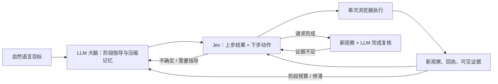

# LLM 大脑与 Jev 小脑的动态反馈循环

目标是以较少的生成式模型调用完成网页长任务，重点评估成功质量、端到端延迟、输入输出 tokens 和费用。取消预先编写的任务专用控件规则、实体枚举、字段白名单和验收 DSL；并非取消运行预算、真实 DOM grounding 和源限制。

## 循环



- **LLM 大脑**：初次提供可复用的阶段指导；阶段窗口耗尽、Jev 请求帮助、结果不明或停滞时再调用。输出短期目标、工作记忆、可见证据引用和阻塞原因，不生成完整任务 DAG。默认 `brain_interval=12`，它是触发上限，不保证每 12 步才调用一次。设为 1 是每步大脑对照。
- **Jev 小脑**：根据目标、大脑指导、当前 DOM、最近回执和证据选动作。存在未确认动作时，同一个 TypeSafe HTTP 请求并行询问 `outcome` 与 `action`；只有上步结果确认后，控制器才消费下一动作。结果头无需串行增加一次模型请求。
- **执行器**：只执行当前候选绑定的观察引用。表单填值在控件选中后由 LLM 按需生成；select 必须属于实际观察的选项。所有可变更状态的点击、填写和选择只派发一次，过期/明确拒绝的动作可重新观察后决策。
- **反馈与记忆**：每次观察按通用格式保留可见文字/控件状态摘录和来源，无业务字段解析。LLM 在被触发时结合新增证据压缩工作记忆。完整记录与每次发给 Jev 的视图分离；近期操作详细，较早操作简短，远期保留计数，关键节点与待确认转移独立保留。
- **候选空间**：从当前控件能力生成 click/fill/select，以及等待、滚动、返回、标签切换、请求大脑和完成。过多候选可翻页。不会让 LLM 生成选择器或可执行代码。

### 延迟控制

- 全 DS 模式可通过可选 `input_sequence` 一次规划 2–4 个当前可见、相互独立的普通文本框，首项必须与 `stage_entry` 一致。所有字段仍需要精确 planned input 与 fill 阶段授权，每次填值保留原输入辅助及校验。只有前一步派发成功、得到新观察的精确输入值回读，且页面文字、控件结构、其他值、标签和阶段未变化，才交付下一项而省掉一次 Policy 请求。唯一语义匹配可重绑 DOM ID；新菜单、导航、派生值变化、歧义、未知效果或任何新模型复核均撤销序列。组合框、搜索、表格、按钮与 Save/Submit 不进入序列；不跨会话恢复。事件 `input_sequence_armed/selected/cancelled/finished/discarded` 用于检查是否真正减少请求。
- 浏览器在观测中记录 `document_id=performance.timeOrigin`，作为浏览器新文档证据。已授权只读验证阶段的独立 Refresh/Reload 按钮，派发成功后如果同页、同标签、同 frame 出现新文档且 HTTP 成功、已加载、无新运行错误，可仅确认 `document_reloaded_ui`，允许报表内容不变。此回读不增加业务 write checkpoint，不关闭验证义务，也不确认 Save/Submit；业务表单、行内按钮、弹窗、未知派发和缺少文档标识均不走此路径。输入序列遇到新文档也撤销。它解决同内容刷新被一直当作未确认业务写入的问题，不绕过最终评分。
- 明确显示为 `Search` / `Search...` / `Search…` / `搜索` / `搜尋` 的普通 textbox 也保留查询焦点，不因 HTML type=text 自动按 Tab。这是输入方式，不新增动作权限或确认；组合框、原生 search 的原有处理保持，普通文本/文本日期控件继续失焦提交。成功派发的 receipt.detail 记录 `automatic_blur=skipped; reason=observed_search_field`，可用于后续查证实际执行方式；它不证明账户选中或业务保存。此类搜索框不进入独立输入序列。
- 具名搜索 textbox 使用一次原生键盘输入精确查询，以支持需要 keydown 才打开的建议控件；先清空原查询，等待 focus 的帧回调，再输入，不按 Enter/Tab、不自动选择结果。控制字符在派发前拒绝；输入途中异常返回 unknown，不能退回 fill 重试。回执另记 `input_method=native_keyboard`。这是输入机制，最终仍须新观察确认查询和独立选择账户/记录；非 ASCII 字符的原生输入是否产生 keydown 由浏览器决定，不能保证所有建议控件都打开。

- 阶段反馈与完整反馈统一接受较大的工作记忆，短期目标上限从 600/1,000 提高到 4,000 字符。活跃记忆容量提示为 64,000 字符，达到 48,000 时先调用大脑压缩早期内容，再原样拼回最近 6,000 字符，总计最多 24,000。记忆按旧到新排列，保留当前阶段、近期结果和未完成事项，允许丢弃早期已完成细节。输入先解析再压缩，不会因为旧的 1,800/5,000 字符校验而中断。
- 压缩失败或无剩余调用预算时，保留最近 24,000 字符继续执行。待确认操作、可信任务/约束和完整来源证据独立保存，不受摘要删减影响。`memory_compressed` 记录前后长度和处理方式；压缩请求以 `dynamic_memory_compression` 进入模型账本，计入大脑统计及 `max_feedback_calls`。

每次 Jev 请求还会进行确定性的上下文投影，不需要额外模型调用：

- 最近 6 次操作保留较详细的动作摘要、精确输入值和观察后的 URL；之前 24 次缩为短摘要；更早操作只通过操作/目标/回执计数提及。计数覆盖完整时间线，最多展示 32 组，并标记是否截断；`ok` 只表示执行回执，不能证明业务已保存。
- 工作记忆按旧到新排列：最近 6 段最多 900 字符，之前 12 段最多 200 字符，更早段落仅保留标题。非常久远的普通细节退出请求视图，历史版本仍保存。
- 大脑可在阶段反馈和完整反馈中用 `notes[].critical=true` 标记需要长期保留的标识、关键节点或重要失败。只有在当前观察中能找到原文的节点才能入库；保留精确引文、页面来源与时间、`quote_grounded_only` 标记，不把解释提升为独立验证结论。后续普通摘要不能删掉已保留的关键节点。可信目标、约束、当前 blockers、待确认与中断操作也不随时间衰减。
- 相同控件上下文只保存一次；候选动作通过控件 ID 引用当前状态，保留所有候选 ID、精确输入值和当前控件值。长页面文字标记为摘录，历史节点不能替代当前页面证据。
- 默认 Jev 请求总预算改为 **48,000 token**（`JEV_CONTEXT_MAX_TOKENS`）；同时遵守供应商 **state + 最长 question ≤ 32,000 token** 的单头限制。Jev 未公开离线 tokenizer，因此本地使用 `o200k_base` 代理计数、10% 余量及 256 token 封装预留，日志明确标注估算，不能宣称供应商精确计量。官方 DeepSeek API 默认 **1,000,000 token**（`DS_CONTEXT_MAX_TOKENS`），Policy、Feedback、Input、Readback、Finish 共用此窗口；使用官方 V4 tokenizer 数据估算消息正文，计入封装和至少 16,384 token 输出预留。API 返回 usage 才是实际 token 数。
- token 模式下，旧 `JEV/POLICY/BRAIN/BRAIN_FINISH_CONTEXT_MAX_BYTES` 仅作为压缩软目标的基数（85%），不再是硬拒绝条件；无法压到软目标但仍在 token 硬限制内时，发送最小投影。非 DS 的其他 chat provider 保留原字节限制，除非明确配置对应 `*_CONTEXT_MAX_TOKENS`。原文档中的 48KB/96KB/256KB 硬限制描述仅适用于旧版实验或这些兼容路径。
- 压缩仍优先削减远期普通历史，旧关键节点保留档案引用，近四条关键事实、当前控件精确值、pending、原任务及执行范围保持。完整证据不从档案删除。模型硬 token 限制超出才在 HTTP 前停止，不为了达到字节软目标删除保护内容。`context-projections.jsonl` 新增 token 估算、输出预留及 memory/observation 子字段字节统计，便于按需诊断；字节数用于传输体积分析，不能当作 token 数。

首次部署在 macmini 安装项目依赖，再运行 `.venv/bin/python scripts/install_context_tokenizers.py`。安装器只加载官方压缩包中的 `tokenizer.json` 数据，不执行其中的 Python；数据存放 `~/.cache/jev-longseq/tokenizers/deepseek-v4.json`，不入 Git。缺少数据时明确失败，不偷偷用字符比例替代。可用 `DEEPSEEK_TOKENIZER_PATH` 指定数据路径。按角色覆盖用 `POLICY_CONTEXT_MAX_TOKENS`、`BRAIN_CONTEXT_MAX_TOKENS`、`BRAIN_FINISH_CONTEXT_MAX_TOKENS`；输出预留用 `CONTEXT_OUTPUT_RESERVE_TOKENS`，请求显式 max_tokens 更大时取较大值。

`context-projections.jsonl` 记录前后字节数和压缩级别；`memory.json` 保存 `key_nodes_archive`、`working_memory_archive`、`event_archive`。续跑恢复这些档案，旧产物通过 trajectory 和父级记录恢复历史。投影不会修改原始 task、完整来源证据或运行中的 Memory；最终完成复核继续使用来源证据档案。
- 反馈容忍 JSON 代码围栏及字面量 `type="object"` 元数据；其余额外字段和真实证据/完成校验仍严格检查。
- 引用校验先修复纯空白差异（空格/换行/制表符），归档仍使用当前观察中的原始子串，记录 `feedback_quote_normalized`。非完成、非 confirmed 的反馈可丢弃无来源引用而保留阶段建议或 pending/unknown 结果，记录 `feedback_notes_discarded`，不会为了这些引用额外调用大脑；unknown 的未确认操作仍停止，不重新派发。局部 confirmed 可在独立的当前 `readback_quote` 与可见变化都通过校验时丢弃无来源的附带 notes；缺少动作证明和 complete 的引用错误仍最多纠正一次。已知历史引用只记录原来源，不提升为当前证据。诊断包含字段位置、长度、哈希、阶段、尝试次数、交互范围与 outcome；不会把旧页证据或改写后的文字当作当前证据。
- 密码框观察区分空值与已填但隐藏的 `[redacted]`。空到已填的变化只证明字段已填，不证明凭据正确或登录成功；不会把空密码框误报为已填。
- 点击读回区分当前动作的直接效果与完整阶段目标，避免把“关闭弹窗”一直等待成“找到目标记录”。普通动作的等待次数耗尽前，额外进行一次大脑读回复核；点击仍要求可见变化。fill/select 的目标控件若已经显示所需值，允许在同页、同标签、同控件的新观察中确认输入，即使页面没有变化；隐藏密码不能据此确认字面值，输入确认也不代表保存/提交成功。
- 普通原生 input 填写后用 Tab 完成失焦确认，避免日期控件在未触发 change 时恢复旧值；combobox 和搜索输入保留焦点，随后选择结果或单独提交搜索。
- 尚未派发的具名点击返回 stale 后，在同页同标签的新观察中重新定位唯一的同角色、名称、值、链接与上下文目标，最多重选两次。目标消失、歧义、页面/弹窗变化或新的大脑指导会撤销重选；结果未知的操作不重放。
- 登录/导航在动作预检期间销毁旧执行上下文时，返回 `stale` 并重新观察，不终止任务；只有尚未派发的动作可以重新决策，派发后的写入异常仍返回未知结果，不自动重试。

- `--preconnect` 可在浏览器准备期间，用同一 HTTP 连接池并行访问模型服务根地址。不发送认证信息或模型请求体，HTTP 401/404 属于可接受的连接准备响应。最长等待 5 秒，失败不阻止实际模型请求。记录在 `network-preconnects.jsonl`，准备时间计入端到端耗时，不伪造 token usage。
- 搜索提交后的 `pending` 默认至少等待 `search_readback_grace_s=3` 秒才因重复 pending 调用大脑，同时仍保留至少两次观察、原有等待次数与总预算。达到等待次数上限时仍执行一次必要复核，结果未知时不重新提交。该参数可在 tuning 中设为 0 恢复原触发时机。
- 最终复核请求保留完成条件、当前证据、完整来源归档和最终答案，但不要求再次生成工作记忆。若复核未完成，使用新的 `next_goal` 继续推进；保留此前工作记忆。解析器兼容旧版完整反馈，避免因额外的合法工作记忆字段重试。
- Chrome 启动细分记录 CDP 发现、Playwright 启动、CDP 连接、新标签页、配置、初始导航及收尾。父子 span 不应重复求和。

本次实际重录、变化与限制见 [Staycation 优化记录](STAYCATION-OPTIMIZATION-20260927.zh-CN.md)。

### 成功率优先的迭代准则

- 首要指标是有效官方评分与整项成功；同时比较总耗时、模型请求数及延迟。局部错误消失或单元测试通过不能代替成功率提高。
- 保持 provider/model、原任务、恢复点与全局预算不变，用新输出目录逐项试验。先验证减少规划/动作选择往返，再验证重复查证与剩余义务/依赖管理；不把多个机制同时改变后归因给其中一项。
- 同分更快只算效率证据；单次分数上升需重复/跨任务验证，不能宣布总体成功率提高。分数下降或新早停必须保留失败证据并重新评估改动。不得以跳过必要查证、放宽确认条件、注入隐藏评分或扩大预算来制造进步。

## 输入与兼容

主要入口为 `jev-browser browse URL --goal '...'`，默认动态模式。也可用 `run` 读取：

```json
{
  "id": "my-task",
  "control_mode": "dynamic",
  "objective": "Find the information I requested and report it with evidence.",
  "start_url": "https://example.com",
  "allowed_origins": ["https://example.com"]
}
```

动态任务拒绝混入旧的 rules、success_predicates、bindings、approved_writes 或 extraction.fields。结构化任务仍保留原有行为，并强制非空成功谓词，避免空列表导致自动成功。目录演示在 dynamic 模式中只提供自然语言目标，不传预枚举实体或隐藏判分器数据。

## 效率测量

每个报告的 `efficiency` 含：

| 项目 | 含义 |
|---|---|
| by_component.brain | 阶段指导、异常反馈、记忆压缩、完成复核的 HTTP 尝试、成功响应、tokens 和请求累计耗时 |
| by_component.jev | Jev 请求；一个请求可含结果头和动作头 |
| by_component.input_helper | 实际选中输入控件后生成参数的请求 |
| total | 所有调用合计，包含失败重试；未返回 usage 单独计数 |
| actions_per_brain_response | 浏览器动作数 / 大脑成功响应数，包含最终复核 |
| known_input_tokens_per_action | 已知输入 tokens / 动作数，应结合成功率判断 |
| end_to_end_s | 浏览器启动、模型请求、执行和收尾总墙钟时间 |

没有模型单价时，费用为 null。请求累计耗时包含传输及该请求内的重试退避，并非纯推理时间。不同模型的 token 单价不同，不能仅因总 tokens 下降就断言美元费用同比下降。单次延迟也会受服务抖动影响。

使用同一任务、后端、模型、候选数和预算，对照 `brain_interval=1` 与 `12`。同时报告严格完成、访问覆盖、错误/重复操作与资源开销；不将提前失败的低消耗记为效率提升。离线假模型测试只验证调度次数，不用于宣称真实延迟或 token 收益。

本轮两次真实试跑及其失败边界见 [效率试跑记录](DYNAMIC-EFFICIENCY-PILOT.zh-CN.md)。

## 语义与边界

- Jev 的结果确认和 LLM 的最终复核都是模型判断；代码检查真实引用、fresh observation、可见变化和证据引用存在，不证明业务语义正确。
- 用户任务没有手写验收规则，也没有隐藏判分器。因此 `status=success` 表示新观察下语义复核通过，`strict_success=null`。自建/公共 benchmark 的独立判分器仍只在运行结束后执行。
- 所有点击都保守地视为可能改变状态。如果点击后没有可见变化，会等待并在上限后停止，而不是重试提交。可见变化与引用无法保证服务器级幂等；跨不同状态的重复业务操作仍依赖模型判断。
- 任务目标和约束是业务授权来源；没有预配置规则时，不再宣称存在代码级的业务写入白名单。页面内容、记忆和大脑建议仍标为不可信数据。
- 通用摘录每视图最多 2,400 字符，Jev 上下文保留近期摘录；工作记忆接近容量时自动压缩，优先保留近期。长页面截断、摘要遗漏、早期细节丢失、页面噪声和语义复核误判仍是风险，不能用一次目录任务代表任意网站泛化。
- 浏览器仍只支持已有的主 frame 可见 DOM 能力。iframe、验证码及源限制继续由执行层处理。


### 派生字段恢复与输入回读

- 恢复草稿时按字段名称、角色、行上下文和值校验，不只比较值列表。可见只读字段及其必填标记也会进入观察；只读字段不会生成操作候选。必填状态仅依据可见星号或原生/ARIA 语义；HRMS 隐藏只读字段的必填星号时，不读取隐藏 metadata。
- 遇到 Quick Entry 的 `fields_dict` / `refresh_field` 异常且完整表单的可见只读派生字段为空时，只允许根据原 checkpoint 的已选 option 做一次清空、原生 Tab、填回和重选。派生字段回读仍为空就停止，不重复请求模型或重放未知操作。恢复保持原任务和完整记忆档案。
- 有成功 dispatch receipt 的 fill/select，在新的观察中同一目标、名称、行上下文及精确值均一致时，可直接确认输入值。此确认不代表 Link 已解析、表单已保存或业务目标已完成；隐藏密码和未知 receipt 仍需其他证据。同值输入已满足时不再发送；Save/Submit 的重复保护保持生效。
- 连续 WAIT 在请求视图中合并，近期详细记录按实际操作计龄。关键节点仅合并完全相同的事实并保留额外来源引用，完整事件及关键节点档案不受投影视图影响。JavaScript 异常单独保留，避免被后续网络噪声挤出。

2026-10-01 在 macmini 的隔离 HRMS 环境复现并验证：旧恢复得到空 Company，同时出现 `fields_dict` / `refresh_field` 异常；完整表单内做一次清空/Tab/填回/重选后，Company 显示 `TechVista Solutions Pvt. Ltd.`，恢复字段校验通过，耗时约 9.7 秒。原 checkpoint 的完整 memory 导出保持一致。验证未调用模型、未 Save/Submit；这是恢复链路验证，不代表整项 business_031 已通过评分。

派生字段修复并完成新观察校验后，已解决的异常会在 `resume-bootstrap.jsonl` 连同可见字段归档，退出当前活跃错误视图；浏览器完整错误档案保留。之后再次发生的同名异常仍会作为新错误展示，避免把已恢复的历史故障误用于后续页面。


### 弹窗回读与证据作用域（2026-10-01）

`fixed-01` 官方得分为 2/15，三条离职活动及负责人正确，离职单已保存但仍为 Draft。点击 Submit 后出现 `Permanently Submit HR-EMP-SEP-2026-00001?`；浏览器只提供该弹窗的 close/No/Yes 控件。大脑仍引用 `textbox Separation Begins On = 2026-06-30` 和 Department/Designation 控件字符串。这些字符串有真实历史来源，但当前 modal 下不可见。旧 harness 对 confirmed 的所有 notes 做当前子串校验，一条过时附带引用就让完整反馈失败；第二次修复仍失败后终止，尚未派发 Yes。所有 87 次请求都是 HTTP 200，无 context 超限。

- `readback_quote` 独立承载当前动作的直接效果；notes 为附带上下文。大脑输入明确当前交互范围和 pending 的局部 expected_goal，避免以完整阶段完成作为点击回读要求。
- 当前引文按原观察归档；可定位的历史引文只记录原 source/observation 引用，不重新标为当前、也不创建新的 critical 节点；无法定位的附带引文不进入证据档案。在非 complete 的 confirmed 中，丢弃未知附带引文必须同时有当前精确 readback_quote 和可见变化。整个目标的完成校验保持严格。
- 新确认弹窗仅在成功 receipt、同页同标签的新观察、此前无 dialog、问句包含已点击按钮的动作、唯一肯定/否定按钮且无新增运行时异常时直接回读。`confirmation_scope=dialog_opened`，`business_commit_confirmed=false`；保存、提交等实际业务效果仍需之后的独立动作和观察。
- 无法证明的局部动作仍保留 pending、consumed 和证据；一次修复仍无有效证据则返回 needs_attention，不把引用格式问题泛化成运行崩溃，不重发未知操作。unknown、timeout、error 的 dispatch 不能凭任意页面变化确认；已有的精确链接目的地 HTTP 回读例外保留。
- 支持的典型确认动作包括 submit/save/publish/approve/delete/remove 及对应中文标签；未识别弹窗继续走模型回读，不通过猜测强行确认。


提交后的信息弹窗还可能遮住表单。例如 HRMS 显示 `Shared with the following Users with Read access`，关闭后才可观察只读字段和 Cancel 控件。harness 仅允许策略选择“当前唯一可操作控件是 Close”的信息弹窗关闭动作用于检查，保留原动作 pending 和 write key，独立记录 `readback_inspection`；有 Yes/No/Cancel、可编辑字段或其他操作控件时不适用。关闭动作结果未知就停止，不重发。后续仍需新的表单观察来确认原业务操作。

验证：macmini 上相关回归测试 252 项通过，Ruff 和 diff 空白检查通过。隔离 HRMS 实际界面回放从安全 checkpoint 恢复并重放原操作，经过 Submit → Yes → 信息弹窗 Close → 表单回读；共 3 次 harness 动作、0 次 WAIT、2 次脚本反馈、0 次模型 API 调用、0 次 invalid_feedback。过时日期及部门引用记录原历史来源，未重新归档为当前证据；Close 前后原提交 pending 保持同一对象，关闭后才基于当前 Cancel 控件和表单变化确认局部提交。诊断产物位于 macmini 的 `runs/diagnostics/harness-modal-20261001`，隔离应用已清理。这是使用脚本反馈的真实 UI 回归验证，并非新的完整 business_031 模型跑分；最终任务 complete 仍为 false。

### 长序列请求预算管理（2026-10-01）

`fixed-02` 官方评分 3/15：离职单 docstatus=1，三条活动及负责人正确，Submit 弹窗阻塞已解除。随后在 Employee Exits 报告停止于 Jev 的 48,000 字节本地预算。保存产物重建的最后请求（候选集可能与现场 consumed 集合略有差异）在旧最强投影中计为 49,105 字节，实际 HTTPX 序列化为 46,769 字节，说明计量空格导致边界误拦截；普通工作记忆仅约 0.7 KB，关键节点仍约 9.9 KB。修复后同一重建输入的最强投影约 40,988 字节，不增加 Jev 硬上限。

- byte budget 和遥测统一采用 HTTPX 的 UTF-8、无额外空格 JSON 序列化；所有投影记录 purpose、各部分大小、软/硬上限、压缩级别。超限也记录诊断及 `request_dispatched=false`。
- 请求只保留一个操作时间线，合并重复 literal 为 `literal_values`；候选 ID、原始 Action 和执行值不改变。最近操作仍优先，远期统计缩短并明确标记截断。
- 压力下最近四个不同关键事实保持完整，更早节点显示摘录、历史标记和 `archive_ref`；重复 URL 使用共享表。完整原文和全部来源仍留在 Memory 档案，不把旧状态覆盖为新事实。大脑可通过 `evidence_requests` 只读取回档案原记录，不能用该接口请求任意网页。取回期间不派发浏览器动作、不接受中间完成声明；每次反馈尝试最多三次调用，仍受总反馈预算约束。
- API 大脑的反馈、输入参数生成、记忆压缩和最终复核采用同一投影机制，默认普通入口 96,000 字节（`BRAIN_CONTEXT_MAX_BYTES`），最终复核 256,000 字节（`BRAIN_FINISH_CONTEXT_MAX_BYTES`）。这些是可配置的本地字节限制，不宣称等于供应商 context window。输入参数请求只携带选中控件，精确 options/value 保留；近期记忆尾部、当前回读原文和最终复核的完整来源档案不截断。
- 无法把保护内容放入硬预算时，控制器返回 needs_attention，保留原 pending/consumed 和全部档案；不发送模型请求，也不重试业务提交。最终档案超限同样停止，不能通过删证据获得 complete。

验证：macmini 完整 pytest 为 409 passed、3 skipped，Ruff 和 diff 空白检查通过。真实模型重跑 `saas-longseq-business031-20261001-fixed-03/saas-bench-business_031`，初始 Task 与 working_memory 均与前次完全一致，恢复 78 条历史操作。保持 Jev 48,000 字节上限，92 次 Jev 投影最大 40,742 字节；16 次大脑反馈投影最大 70,946 字节；8 次输入参数投影最大 39,122 字节。全程 0 次 context overflow、0 次 invalid_feedback；真实运行没有触发档案 lookup，该路径由回归测试验证。

官方评分仍为 3/15：离职单 docstatus=1、三条活动与负责人正确。执行 86 个动作后停在 Employee Exits 报告的命令搜索弹窗：指导要求退出弹窗，策略选中了没有名称的按钮，点击后弹窗仍在，反馈返回 unknown；控制器保留 pending 并以 needs_attention 停止，不重复该操作。BigCapital/Twenty 尚未执行。这是新的控件语义/弹窗退出限制，不是上下文预算故障；隔离环境清理成功。

### 搜索弹窗退出与异步回读（2026-10-01）

`fixed-03` 最后点击的无名图标实际是 Help。它异步打开 Search Help，旧观察仍包含底层命令搜索框；慢反馈返回 unknown 时，现场已经出现帮助弹窗。命令搜索只显示 `esc to close`，没有普通关闭按钮。关闭帮助后，焦点也未必回到命令搜索输入框，单纯发送全局 Esc 无法可靠退出。

- 图标语义增加 help/question/info/clear，Help 优先于 search，不将帮助图标解释为关闭。观察只暴露最前方可见 dialog 的控件和文本，避免操作底层弹窗。
- 仅在前台搜索弹窗中存在唯一启用的搜索输入、可见 `esc to close` 提示，且无其他业务编辑字段、确认或提交控件时，提供绑定提示 DOM 的 `Close dialog (Escape shortcut)` 控件。执行仍经过新观察及 DOM 句柄预检，原生聚焦搜索字段后发送 Escape。绑定失效时拒绝派发；重选不会将快捷键退化为同名普通按钮。该能力不修改 Task 操作集合或原始任务目标。
- 成功派发 Help 后，只有同页同标签的新帮助弹窗、帮助标题、唯一 Close 控件且无新增运行时异常，才可直接确认弹窗打开；保存标题和观察证明，明确 `business_commit_confirmed=false`。业务提交仍需独立回读。
- 成功派发但模型回读 unknown 时，每个 pending 最多补一次新观察。只有同页同标签的语义状态已变化，才重新评估；不重放操作，不丢弃 pending/consumed，不用刷新直接确认。派发状态未知仍停止，防止无效或重复业务重试。

验证：macmini 完整回归 421 passed、3 skipped；最后补充保护后的定向回归 170 passed，Ruff 与 diff 空白检查通过。隔离 HRMS 从安全 checkpoint 验证 Search → Help → Close → 可见 Esc 退出两层弹窗，最后无 dialog；0 次模型调用，未 Save/Submit。诊断位于 `runs/diagnostics/palette-20261001`，隔离环境已清理。

真实模型重跑 `saas-longseq-business031-20261001-fixed-04/saas-bench-business_031`：Task 与 working_memory 均与前次完全一致，恢复 78 条历史操作。策略通过可见 Escape 退出搜索弹窗，进入 BigCapital，创建供应商后官方校验显示 `display_name=Ananya Reddy, email=ananya.reddy@gmail.com`。官方评分 4/15，较 fixed-03 增加供应商的 1 分；离职单提交和三条活动仍通过。无 invalid_feedback、重复业务写入或 constraint violation。执行预算计数 141，135 条实际派发记录，41 次大脑调用，agent 耗时约 547.5 秒；环境清理成功。Journal、Payment 和 Twenty 尚未执行，不代表整个任务成功。

随后点击 BigCapital Quick find 时，最强旧投影为 48,668 字节，超过 Jev 48,000 字节硬上限，控制器保留 pending 并在请求派发前停止。32 个关键节点的请求索引占约 12 KB；早期节点虽已摘录，字段名和历史标记仍逐条重复。这是新的索引增长问题，不是搜索退出修复失效。

### 关键节点索引的应急压缩档位（2026-10-01）

当前三档投影仍未达到软目标时，增加第四档：最近四个不同关键节点保持全文；较早节点采用共享列定义的 `historical_key_nodes` 表格，所有 archive_ref、URL 引用和验证级别保留。较近八条历史节点保留原摘录，更远节点的 quote/interpretation 缩到 48 字符。表格明确标为历史摘录，只提供检索线索；原文、来源及完整执行档案不改变。Task、当前控件、候选绑定值、pending 与 blocker 不缩短。Jev 和大脑入口共用该档位，最终完成复核的完整证据档案仍受保护。

macmini 离线回放 fixed-04 的最终观察、memory、consumed 集和原模型名：原始请求 104,711 字节，旧第三级投影 48,668 字节，与现场记录完全一致；新增第四档为 44,900 字节。139 个候选、pending、最近四个完整节点及完整 memory 档案均保持一致，0 次模型调用、0 次业务动作。诊断为 `runs/diagnostics/context-fixed04-20261001/result.json`。此回放验证请求可发送及档案完整性，未再次进行整项模型跑分；4/15 属于第四档修复前的 fixed-04。

最终验证：macmini 完整回归 423 passed、3 skipped；表格严格列数断言补充后的预算模块测试 15 passed。Ruff 和 diff 空白检查通过，运行源码、测试、文档已同步 macmini。

### 同值输入循环与 stale 选项恢复（2026-10-01）

`fixed-05` 官方评分 0/15，停止于第一行 User 的未解析文本 `Rajesh Kumar`；Jev 最大请求 40,773 字节，无 context overflow 或 invalid_feedback，尚未到达第四档压缩的验证位置。负责人选项的点击在预检时 stale，随后当前 dropdown 仅有 Create a new User / Advanced Search。策略反复选已填的 Activity Name 和 User，15 次同值输入虽被跳过，却留下输入缓存，被后续调用误称为 undispatched stale retry。指导要求清空重查时，旧候选也没有明确的清空操作，输入 helper 仍返回原姓名。最后因恢复后相同页面再次出现而停止，环境已清理。

- 同值输入不派发、不确认 Link 或业务提交，并立即清除输入重试缓存。仅在页面语义、控件状态和 next_goal/working_memory 均未变化时，屏蔽该控件已知无效的未绑定 fill/select；不同值的原任务文字候选、其他控件及清空候选仍保留。页面或指导变化后重新开放，当前抑制记录进入 execution_feedback。
- 有非空可见值的启用可编辑控件增加 `Clear` fill 候选，明确绑定空字符串，作为观察到的输入重置能力；无需再请求模型猜测清空值。只读、禁用控件和 `[redacted]` 密码不提供该候选，原 Task 权限及业务提交保护保持不变。
- stale 的 option/menuitem 无法在新页面按原完整语义唯一重选时，立即触发 `stale_target_changed` 反馈，不继续沿旧指导选择其他填充。未知派发结果仍停止，不能走此恢复路径；原同页同弹窗唯一选项重选保护保留。

macmini 定向回归 139 passed，Ruff 和 diff 空白检查通过。新端到端用例覆盖 stale 选项消失后指导更新、一次同值跳过、Clear → 重查 → 点击精确选项；没有同值派发或缓存复用，也未触发通用 no_progress 恢复。该脚本反馈用例验证调度机制，不代表完整任务业务评分。

完整回归：macmini 426 passed、3 skipped。

真实模型验证 `saas-longseq-business031-20261001-fixed-06/saas-bench-business_031`：Task、working_memory 与原 checkpoint 完全一致，恢复 78 条历史操作。两次 stale option/menuitem 失去原语义匹配时立即重新指导，另有两次新观察下的唯一目标重选；第一行负责人 stale 后成功选中 Rajesh Kumar，继续填写全部活动并提交离职单。全程 input_already_satisfied=0、input_reused=0，旧同值循环未复现。官方评分 4/15：离职单 docstatus=1、三条活动及负责人、供应商显示名和邮箱均通过。两次模型反馈格式错误分别为额外 phase 字段和非 JSON 输出，均经修复继续执行；无业务重复提交或 constraint violation。agent 约 581.9 秒，133 次动作，38 次反馈/输入调用；环境清理成功。

本轮第四档压缩已实际触发，但供应商 Filter 下拉菜单打开后，新请求仍为 48,138 字节，超过硬上限 138 字节；保留 pending 并在请求发送前停止。新增无损共享编码：压力档位下将多数控件 role 提升到 `control_defaults`，将多数候选 operation 提升到 `candidate_defaults`，显式字段覆盖默认值。候选默认值只有净减少字节时启用；候选 ID、当前控件、精确值、操作能力、禁用/unchecked 状态及全部 memory 不改变。原 Action 仍供执行层使用。

macmini 精确回放 fixed-06 最终请求：原始 112,525 字节，与现场一致；旧第四档 48,138 字节，新编码 43,880 字节。162 个候选逐项还原与旧投影完全一致，所有控件和全部 memory 均一致；0 次模型调用、0 次业务派发。诊断位于 `runs/diagnostics/context-fixed06-20261001/result.json`，保留旧投影实现以供比较。该编码定向回归 120 passed，Ruff 和 diff 空白检查通过；4/15 为此编码修复前的真实模型得分，编码修复后尚未再次整项跑分。

共享编码后的完整回归：macmini 427 passed、3 skipped。
