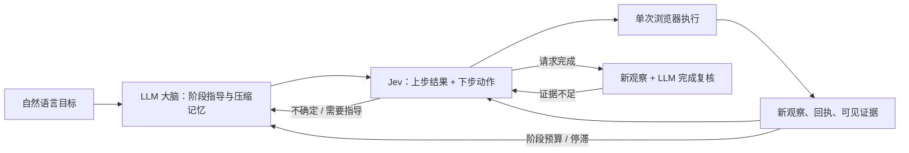

# LLM 大脑与 Jev 小脑的动态反馈循环

目标是以较少的生成式模型调用完成网页长任务，重点评估成功质量、端到端延迟、输入输出 tokens 和费用。取消预先编写的任务专用控件规则、实体枚举、字段白名单和验收 DSL；并非取消运行预算、真实 DOM grounding 和源限制。

## 循环



- **LLM 大脑**：初次提供可复用的阶段指导；阶段窗口耗尽、Jev 请求帮助、结果不明或停滞时再调用。输出短期目标、工作记忆、可见证据引用和阻塞原因，不生成完整任务 DAG。默认 `brain_interval=12`，它是触发上限，不保证每 12 步才调用一次。设为 1 是每步大脑对照。
- **Jev 小脑**：根据目标、大脑指导、当前 DOM、最近回执和证据选动作。存在未确认动作时，同一个 TypeSafe HTTP 请求并行询问 `outcome` 与 `action`；只有上步结果确认后，控制器才消费下一动作。结果头无需串行增加一次模型请求。
- **执行器**：只执行当前候选绑定的观察引用。表单填值在控件选中后由 LLM 按需生成；select 必须属于实际观察的选项。所有可变更状态的点击、填写和选择只派发一次，过期/明确拒绝的动作可重新观察后决策。
- **反馈与记忆**：每次观察按通用格式保留可见文字/控件状态摘录和来源，无业务字段解析。LLM 在被触发时结合新增证据压缩工作记忆。Jev 只收短工作记忆、最近四段证据、三个动作摘要和待确认转移；完整档案仍在产物中。
- **候选空间**：从当前控件能力生成 click/fill/select，以及等待、滚动、返回、标签切换、请求大脑和完成。过多候选可翻页。不会让 LLM 生成选择器或可执行代码。

## 输入与兼容

主要入口为 `jev-browser browse URL --goal '...'`，默认动态模式。也可用 `run` 读取：

```json
{
  "id": "my-task",
  "control_mode": "dynamic",
  "objective": "Find the information I requested and report it with evidence.",
  "start_url": "https://example.com",
  "allowed_origins": ["https://example.com"]
}
```

动态任务拒绝混入旧的 rules、success_predicates、bindings、approved_writes 或 extraction.fields。结构化任务仍保留原有行为，并强制非空成功谓词，避免空列表导致自动成功。目录演示在 dynamic 模式中只提供自然语言目标，不传预枚举实体或隐藏判分器数据。

## 效率测量

每个报告的 `efficiency` 含：

| 项目 | 含义 |
|---|---|
| by_component.brain | 阶段指导、异常反馈、完成复核的 HTTP 尝试、成功响应、tokens 和请求累计耗时 |
| by_component.jev | Jev 请求；一个请求可含结果头和动作头 |
| by_component.input_helper | 实际选中输入控件后生成参数的请求 |
| total | 所有调用合计，包含失败重试；未返回 usage 单独计数 |
| actions_per_brain_response | 浏览器动作数 / 大脑成功响应数，包含最终复核 |
| known_input_tokens_per_action | 已知输入 tokens / 动作数，应结合成功率判断 |
| end_to_end_s | 浏览器启动、模型请求、执行和收尾总墙钟时间 |

没有模型单价时，费用为 null。请求累计耗时包含传输及该请求内的重试退避，并非纯推理时间。不同模型的 token 单价不同，不能仅因总 tokens 下降就断言美元费用同比下降。单次延迟也会受服务抖动影响。

使用同一任务、后端、模型、候选数和预算，对照 `brain_interval=1` 与 `12`。同时报告严格完成、访问覆盖、错误/重复操作与资源开销；不将提前失败的低消耗记为效率提升。离线假模型测试只验证调度次数，不用于宣称真实延迟或 token 收益。

本轮两次真实试跑及其失败边界见 [效率试跑记录](DYNAMIC-EFFICIENCY-PILOT.zh-CN.md)。

## 语义与边界

- Jev 的结果确认和 LLM 的最终复核都是模型判断；代码检查真实引用、fresh observation、可见变化和证据引用存在，不证明业务语义正确。
- 用户任务没有手写验收规则，也没有隐藏判分器。因此 `status=success` 表示新观察下语义复核通过，`strict_success=null`。自建/公共 benchmark 的独立判分器仍只在运行结束后执行。
- 所有点击都保守地视为可能改变状态。如果点击后没有可见变化，会等待并在上限后停止，而不是重试提交。可见变化与引用无法保证服务器级幂等；跨不同状态的重复业务操作仍依赖模型判断。
- 任务目标和约束是业务授权来源；没有预配置规则时，不再宣称存在代码级的业务写入白名单。页面内容、记忆和大脑建议仍标为不可信数据。
- 通用摘录每视图最多 2,400 字符，Jev 上下文保留近期摘录；大脑工作记忆最多 5,000 字符。长页面截断、摘要遗漏、页面噪声和语义复核误判仍是风险，不能用一次目录任务代表任意网站泛化。
- 浏览器仍只支持已有的主 frame 可见 DOM 能力。iframe、验证码及源限制继续由执行层处理。
